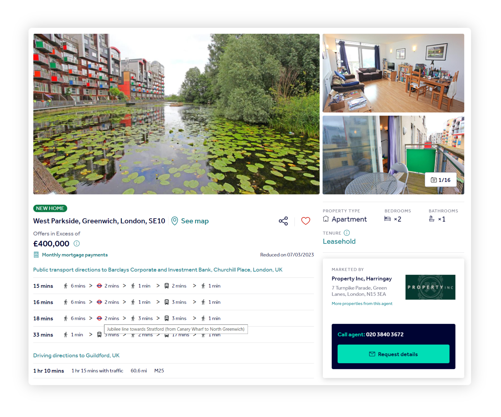
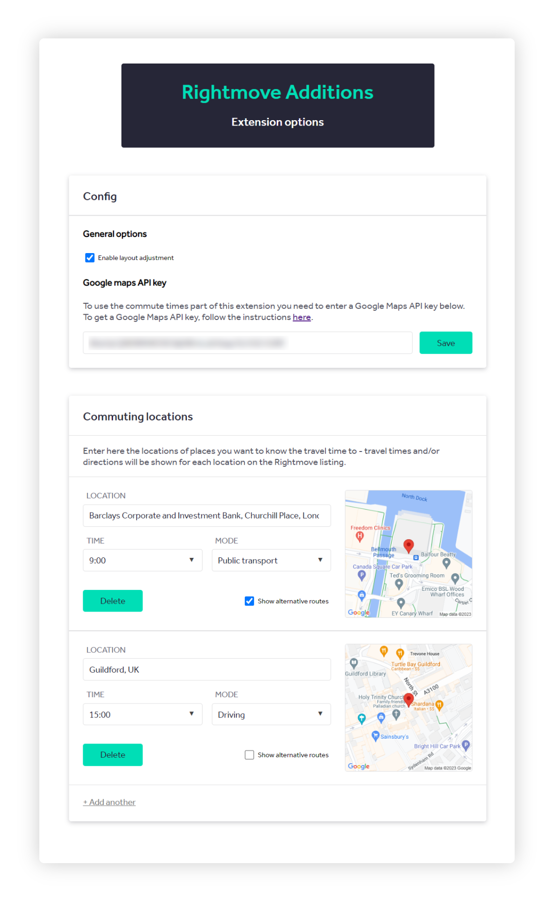

# Rightmove Additions Google Chrome Extension
This extension adds a variety of functionality to Rightmove using a Google Chrome extension that injects extra information into the listing page.

The main bit of functionality is using the Google Maps API to add travel times to various locations, for example to your workplace, your hometown, homes of family & friends, etc. This allows for quick comparison of homes across a large area like London.

